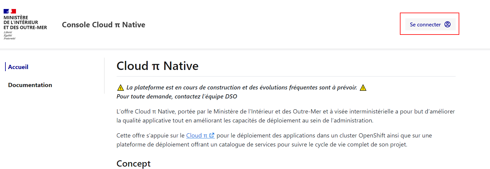
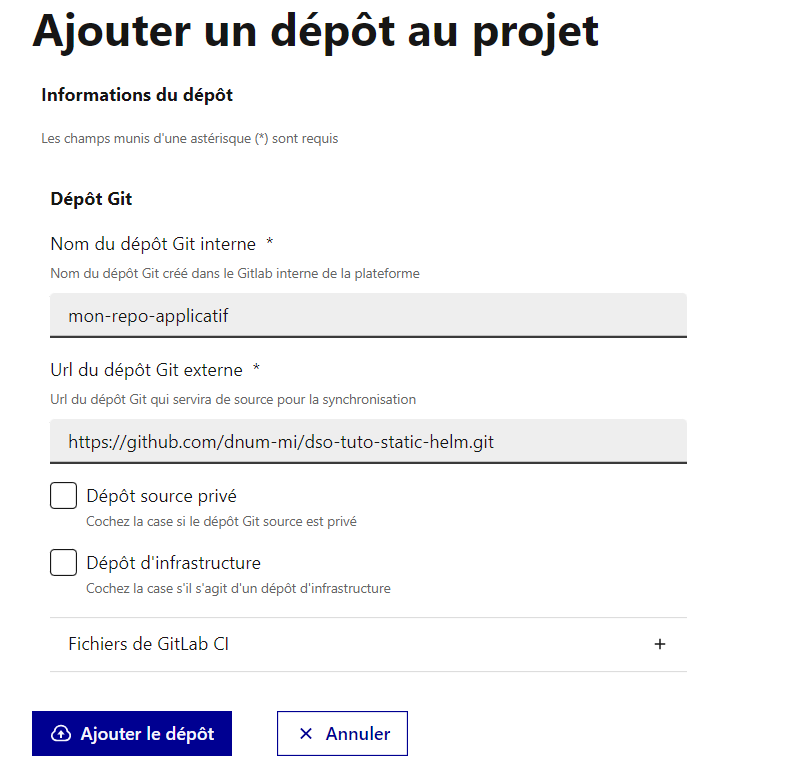
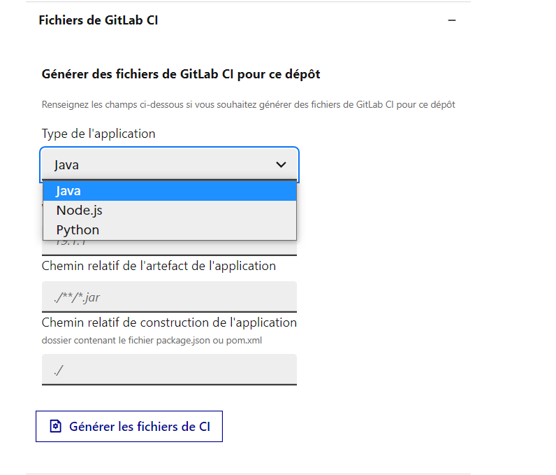

Retour à [l'accueil](README.md)
# Getting Started

la prise en main de l'offre Cloud π Native se fait par la console 

## Etape 1 - Accès à la console

Une fois sur la console, il faut se connecter en cliquant en haut à droite sur le bouton se connecter :


La création de compte se fait en contactant l'équipe DSO ou en envoyant un mail à l'adresse générique du projet <cloudpinative-relations@interieur.gouv.fr>.

## Etape 2 - Mes projets

Une fois connecté sur la console, le menu gauche s'enrichi avec une entrée "Mes Projets" contenant la liste de ses projets.


Un projet au sens console DSO est un projet applicatif regroupant potentiellement plusieurs composants applicatifs. Un projet est lié à 1 à N dépots de code. Un projet correspondra à un namespace au sens kubernetes / openshift

Cliquez sur le bouton **+ Créer un projet** afin d'ajouter un nouveau projet :


Sur cet écran il est nécessaire de renseigner :
 - Nom de l'organisation : correspondant à l'entité administratif de rattachement. A terme, cette liste sera supprimé pour récupérer l'information directement depuis le référentiel utilisateurs.
 - Nom du projet :  Ce nom servira à créer un groupe dans gitlab de l'offre Cloud π Native et sera une composante du namesapce OpenShift créé.

Valider la saisie en cliquant sur **Commander mon espace projet**

La création d'un projet va lancer le provisionnement des différents services de la plateforme (Gitlab, Vault, Nexus, Quay, Sonarqube, ArgoCD), ce qui signifie principalement la création d'un groupe pour le projet dans chacuns des outils, l'association de droits sur ces groupes, la génération de secrets pour l'automatisation, etc...
> Cette opération demande d'attendre jusqu'à quelques minutes.

Ainsi, depuis le menu Mes projets, le nouveau projet est présenté en cours de construction :


A la fin du processus de création, l'icone du projet est modifiée comme suit et devient un lien cliquable :


Au clic sur le projet, on arrive sur la liste des services associés :


Chaque icone permet d'accéder directement aux services de l'offre Cloud π Native directement sur le contexte du projet.

Une entrée dans le menu gauche permet également de voir l'état des services :


### Gérer les membres

:construction: *Disponible prochainement* :construction: 

### Gérer les environnements

:construction: *Disponible prochainement* :construction: 

## Etape 3 - Ajouter un dépôt synchronisé

Une fois que le projet est créé sur la console, il convient d'ajouter des dépôts synchronisés.

En effet, en phase de développement, les équipes projets sont autonomes et travaillent avec leurs outils sans contraintes apportées par l'offre Cloud π Native. La synchronisation des dépôts est le processus qui permet de *copier* les dépôts externes stockés sur github, gitab.com, bitbucket, etc. vers le repo de code de l'offre Cloud π Native. la seule contrainte est que le repo externe soit accessible depuis Internet. Ce repo peut être public ou privé. Pour plus d'information, voir la page dédiée au [repo de code](produits/gitlab.md)

Cliquez sur le menu gauche **Dépôts synchronisés**


Puis sur le bouton **+ Ajouter un nouveau dépôt**



Remplir le formulaire de synchronisation des dépôts:
  - Choisir un nom
  - Saisir l'URL du repo git distant. Dans le cas d'un repo privé cocher la case et préciser les credentials d'accès
  - Deux types de repo peuvent être ajouté : 
    - Un repo applicatif : contenant du code applicatif et qui sera construit afin de créer des images Docker à déployer sur l'infrastructure cible.
    - Un repo d'infra : contenant les manifests de déploiement ou chart HELM contenant *l'infrastructure as code* du projet à déployer


Dans le cas d'un dépôt de code applicatif, générer les fichiers de *gitlab-ci* en cliquant sur le bouton *Fichiers de Gitlab CI*. Le fichier `.gitlab-ci-dso.yml` est à placer à la racine de votre dépôt externe et les `includes` (les autres fichiers `.yml`) sont à placer dans un dossier `includes/` à la racine de votre dépôt externe. Ces fichiers seront utilisés par le Gitlab de Cloud π Native pour effectuer les divers tests, scans et déploiements du projet.

  

Cliquer enfin sur le bouton `Ajouter le dépôt`.

Lorsqu'un dépôt est créé dans la console en tant que `dépôt d'infrastructure`, la plateforme créé automatiquement l'application [ArgoCD](https://argo-cd.readthedocs.io/en/stable/) associée qui permettra le déploiement.


Une fois que le dépôt est correctement ajouté, il apparait avec une icône indiquant son statut :


> Cette opération demande d'attendre jusqu'à quelques minutes.

> Des exemples de dépôts sont disponibles dans la sections [tutoriels](/doc/tutorials).

## Etape 4 : Paramétrer la synchronisation

Une fois le dépôt interne à la plateforme créé et lié à un dépôt externe, il sera important de paramétrer la synchronisation entre le dépôt source et son clône. La création déclenche une première synchronisation. Il convient maintenant de configurer comment se repo sera synchronisé dans le temps.

Pour paramétrer la synchronisation d'un dépôt :

- Un dépôt nommé `<nom_de_votre_project>/<nom_de_votre_project>-mirror` a été créé dans le groupe Gitlab du projet. Dans ce dernier se trouve un script `script-mirror.sh` à copier dans votre dépôt externe.
  > Ce script a pour but de demander à la plateforme de synchroniser le dépôt en effectuant un appel api (avec authentification auprès de l'api gateway).
  > Il faut donc lancer ce script dans la CI/CD du dépôt source selon les évènements sur lesquels on souhaite déclencher une synchronisation (ex: lors d'un push sur la branche main).

- Dans le Gitlab de la plateforme, récupérer dans le dépôt `<nom_de_votre_project>/<nom_de_votre_project>-mirror` le token `GITLAB_TRIGGER_TOKEN` (`Settings > CI/CD > Pipeline triggers`, au besoin en créer un).

- Ajouter les variables d'environnements suivantes dans les __*secrets*__ de la CI/CD externe avec les valeurs fournies par l'équipe DSO ou précédemment récupérées (ces secrets seront utilisés par le script `script-mirror.sh`)

  | Nom de variable      | Description                                                                  |
  | -------------------- | ---------------------------------------------------------------------------- |
  | API_DOMAIN           | Url de l'API Gateway                                                         |
  | CONSUMER_KEY         | Clé d'authentification de l'application au travers de l'API Gateway          |
  | CONSUMER_SECRET      | Secret d'authentification de l'application au travers de l'API Gateway       |
  | GITLAB_TRIGGER_TOKEN | Token de déclenchement du pipeline de synchronisation dans le GitLab interne |

- Ajouter dans la CI/CD l'exécution de ce script pour déclencher la synchronisation automatiquement.
  
  *Exemple avec Github (synchro lors d'un push sur la branche main du dépôt source) :*

  ```yaml
  # Dans un fichier .github/workflows/script-mirror.yaml
  name: Repo sync with Cloud π Native

  on:
    push:
      branches:
        - "main"
    workflow_dispatch:

  jobs:
    mirror:
      name: Sync repo with Cloud π Native
      runs-on: ubuntu-latest
      steps:
        - name: Checks-out repository
          uses: actions/checkout@v3
        - name: Send a sync request to DSO api
          run: |
            sh ./path/to/script-mirror.sh \
              -a ${{ secrets.API_DOMAIN }} \
              -g ${{ secrets.GITLAB_TRIGGER_TOKEN }} \
              -k ${{ secrets.CONSUMER_KEY }} \
              -s ${{ secrets.CONSUMER_SECRET }}
  ```

- Répéter cette opération pour tous les dépôts y compris pour le ou les dépôts d'infrasctructure as code.

La synchronisation est maintenant en place et chaque appel API effectué avec le script `script-mirror.sh` entrainera le déclenchement de la chaine DevSecOps.
