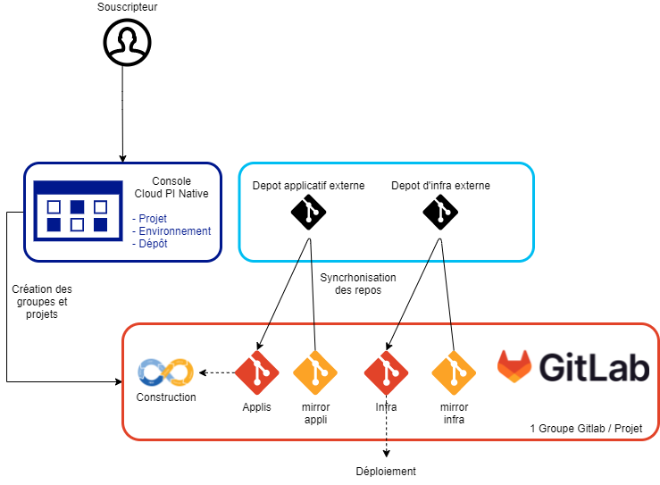

# Gestionnaire de sources

## Présentation
Le gestionnaire de source de l'offre Cloud π Native est Gitlab en version communautaire.

Le principe de l'offre Cloud π Native est de laisser les projets autonomes sur leur chaine de construction sur les environnements de développement et notamment les outils utilisés. Ainsi, une équipe projet peut utiliser le gestionnaire de source qu'il souhaite en amont de l'offre Cloud π Native : Github, Gitlab.com, Bitbucket, Gitlab on premise, etc. et sur des repos publics ou privés. La seule contrainte est que ce gestionnaire soit **accessible depuis Internet** afin qu'il puisse être *copié* sur l'offre Cloud π Native.

Dans la suite de cette page :
  - *repo externe* correspond au repo GIT de dev sur l'outil choisi par le projet;
  - *repo interne* correspond à la copie du repo externe dans l'offre Cloud π Native;
  - *gitlab interne* correspond à l'instance gitlab de l'offre Cloud π Native.

 ## Création d'un projet depuis la Console DSO

Lors de l'enregistrement d'un projet depuis la Console Cloud π Native, les opérations suivantes sont réalisées sur le Gitlab de l'offre Cloud π Native:
 - Création d'un groupe Gitlab : <NOM_ORGANISATION>/<NOM_PROJET> sur le gitlab interne;
 - Attribution de droits d'administration sur le groupe Gitlab <NOM_ORGANISATION>/<NOM_PROJET>à l'utilisateur qui crée le projet;
 - Création d'un repo vide correspondant au repo distant dans le groupe ci-dessus;
 - Création d'un repo "mirror" avec les informations de synchrnonisation permettant, de réaliser un mirroir du repo GIT externe de dev. vers le repo interne créé ci-dessus.

Les repos externes, utilisés en dev., sont synchronisés par la pipeline gitlab-ci du projet *mirror* correspondant. Le déclenchement de cette synchronisation est réalisé par un appel à un API Management ( voir la page de [FAQ](../faq.md) )

Une fois le projet applicatif synchronisé une pipeline gitlab-ci est lancé afin de construire le projet applicatif sur l'offre Cloud π Native.

Deux types de repos sont pris en comptes par l'offre Cloud π Native :
 - Repo applicatifs
 - Repo d'infra.

### Repos applicatifs et chaine de construction Gitlab-ci 

Les repos applicatifs contienent du code applicatifs et génères des images à déployer sur Openshift.

Les projets présents sur l'offre π Native sont paramétrés pour exécuter une pipeline gitlab-ci depuis le fichier .gitlab-ci-dso.yml présent à la racine du projet. Ce fichier doit être créé en amont depuis le repo externe. L'offre Cloud π Native propose des templates de ces fichiers pour la construction de projets de différents langages (Java, nodejs, python, etc.) accessible lors de la création des projets depuis la Console DSO. Ces templates sont directement paramétrés pour utiliser des variables prédéfinies liés au projet courant. Cependant, ils sont donnés à titre d'exemple et doivent être adaptés aux besoins réels des projets.

Les projets applicatifs sont analysés et construits et les images Docker générés sont analysées et déposées sur un repos Quay prêtes à être déployées.

### Variables prédéfinies gitlab-ci DSO

Un certains nombres de variables pré-définies, en plus des variables standards de gitlab :
 - http_proxy, https_proxy, HTTP_PROXY et HTTPS_PROXY, PROXY_HOST, PROXY_PORT,  : paramètres liés au proxy de l'environnement.
 - MVN_CONFIG_FILE : fichier de configuration Maven avec le paramètrage pré-défini de l'environnement et du projet en cours, notamment pour le dépot d'artefact sur le repo Nexus.
 - NEXUS_HOST_URL : URL d'accès au repo Nexus (stockage d'artefacts)
 - NEXUS_HOSTNAME : Hostname du service Nexus
 - NO_PROXY : variable contenant les URL qui ne nécessitent pas de passer par le proxy
 - NPM_FILE : Fichier de configuration NPM pré-configuré pour l'environnement et le projet en cours
 - QUAY_ROOT_URL : URL d'accès à l'instance Quay (image repository)
 - SONAR_HOST_URL : URL d'accès à l'instance SonarQube (analyse de qualité statique)
 - VAULT_AUTH_PATH : PATH dans l'URL d'accès à VAULT pour l'authentification par jwt
 - VAULT_AUTH_ROLE : PATH dans l'URL d'accès à VAULT pour la récupération des roles depuis les appels de Gitlab
 - VAULT_SERVER_URL : URL d'accès à l'instance Vault (gestionnaire de secrets)
 
### Repos d'infra

Les repos d'infras contienent les manifests de déploiement des images issues de la construction des repos applicatifs.

Ces repos ne sont pas contruits mais sont utilisées par ArgoCD afin de déployer l'infrastructure applictive sur Openshift. Ces repos peuvent être au format Kustomize ou HELM et déploiement l'applicatif sur un namespace dédiée au projet et automatiquement créé par la console DSO.

## Schéma de fonctionnement
Le schéma ci-dessous présente le fonctionnement général : 

