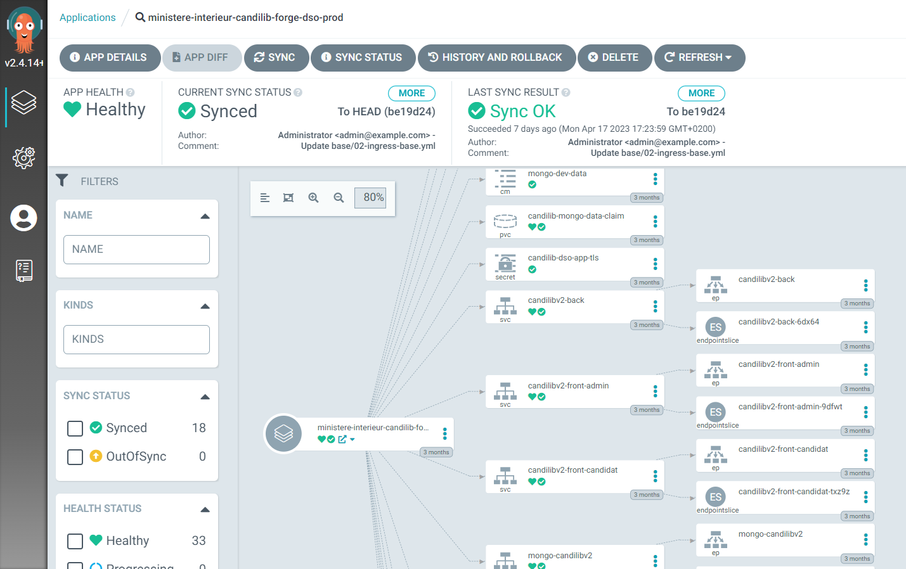

# Gitops

## Philosophie et principes

Gitops est un modèle de workflow permettant provisionner son infrastructure à l'image d'un repo git assurant 
ansi la reproductibilité et le versionning. Ceci implique :
  - Toute l'infrastructure est gérée par du code, déposé sur un repo GIT
  - C'est le repo GIT d'infrastucture qui "pilote" les déploiements.

## ArgoCD

L'outil GitOps utilisé sur l'offre Cloud π Native est [ArgoCD](https://argo-cd.readthedocs.io/en/stable/). Cet outil assure la mise en conformité de l'infra avec le repo git d'infrastructure qui est la source de vérité.

Lors de l'ajout d'un repo de type infrastructure depuis la console DSO, un projet ArgoCD est automatiquement créé avec les informations du projet et de l'organisation. Ces repos d'infrastructure peuvent être au format :
  - Kustomize
  - Helm

Un namespace est créé par projet au sens Console DSO. Ainsi, il est possible d'avoir plusieurs repos d'infrastructure pour un même projet DSO, par exemple un au format Helm et un au format Kustomize.

ArgoCD offre une console de déploiement permettant de consulter et visualiser ses déploiement de façon graphique et également d'accéder aux *events* et *logs* de chaque ressource :

## Déploiement et redéploiement

Ainsi, suivant le principe GitOps et afin de déployer une application ou la redéployer, il est nécessaire de suivre les étapes suivantes:
 - Correction d'anomalie et modification du numéro de version (tag) sur le déploiement depuis le repo applicatif externe
 - Synchronisation des repos externes / internes
 - Re build de l'application via le pipeline gitlab-ci sur la forge DSO
 - Construction de l'image Docker et dépot sur le repository de la forge
 - Modification du repo d'infra afin de mettre en cohérence le tag de l'image à déployer
 - Synchronisation du repo externe d'infra

Il est possible d'automatiser ces différentes tâches comme suit :
  - Utiliser l'identifiant de commit court (CI_COMMIT_SHORT_SHA) du repo applicatif comme tag d'image à construire 
  - Lors de la construction sur les repos externe, déclencher une étape permettant de modifier la référence de l'image à déployer sur le repo d'infra externe (kustomize ou helm values) avec l'identifiant du commit ci-dessus.
  - Utiliser des triggers depuis le repo de code applicaitf externe (github Action, gitlab-ci, etc.) pour déclencher la synchronisation des repos vers gitlab-ci de la forge DSO.

> Attention ! Si le tag de l'image n'est pas modifié, aucune modification du repo d'infra n'est effectué et ArgoCD n'aura pas de modification à appliquer et les pods ne seront pas redéployés.
